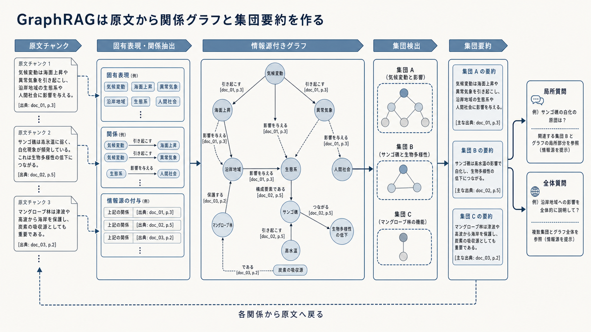

# 9.8 GraphRAG

GraphRAGは、人、組織、製品、出来事などの要素と、それらの関係をグラフとして使うRAGです。
平坦な類似検索では見つけにくい関係の連鎖や、資料群の主要な構造を調べます。

図9-5は、左から原文、要素と関係の抽出、情報源付きグラフ、関係の密な集団、集団要約、質問への利用の順に読みます。
局所質問は関係する部分グラフを、全体質問は複数の集団要約を使います。
下の点線は、要約や関係から必ず原文へ戻って確認する経路です。

**図9-5　GraphRAGの構築と質問への利用**

## 9.8.1 GraphRAGが解く問題

一つの要素の属性を探す局所質問、二要素をつなぐ経路、複数段階の影響、資料群全体の主要テーマを分けます。
[From Local to Global](https://arxiv.org/abs/2404.16130)は、文書から固有表現と関係のグラフを作り、関係の密な集団を要約して、資料群全体に関する質問へ答える方法を提案しています。

単純なFAQや一文の事実までグラフへ送りません。
通常検索で、関係の探索、複数段階の接続、全体把握に失敗する質問を特定してから導入します。

導入効果は、経路の正しさ、必要な関係の回収、全体質問の完全性、費用で測ります。
グラフを作ったこと自体を成果とはみなしません。

## 9.8.2 グラフの種類

既存の知識グラフ、文書間リンク、引用グラフ、固有表現とチャンクの二部グラフ、文書群の階層など、目的の異なるグラフがあります。
既存の信頼できる関係データを使う場合と、LLMで文書から関係を抽出する場合では品質保証が異なります。

要素と関係の意味、関係の向き、有効期間、情報源をスキーマとして定義します。
生成した要約と抽出した関係を、原文の事実と区別します。

目的が特定経路の検索か、全体傾向の要約かを先に決めます。
将来使うかもしれないという理由だけで、大きく複雑な概念体系を作りません。

## 9.8.3 グラフ型インデックスの構築

構築は、固有表現と関係の抽出、同じ対象の統合、元チャンクとの対応、関係の密な集団の検出、集団要約の生成という順で進めます。
各関係に、支持する原文スパン、抽出時の確信度、モデルの版を付けます。

表記ゆれを誤ってまとめると別人物や別製品が一つになり、分けすぎると必要な経路が切れます。
代表的な同名異義語、略称、組織変更を人が確認した評価集合へ含めます。

抽出モデル、概念スキーマ、統合規則、集団検出の設定を版管理します。
原文にない関係を生成しないことと、必要な関係を見落とさないことを別々に測ります。

## 9.8.4 質問の分類

質問を、局所的な要素、関係または経路、全体的なテーマへ分類し、平坦な検索、局所グラフ検索、全体グラフ検索へ送ります。
「製品Xの仕様」は平坦検索、「Xの変更がYへ与える影響」は経路検索、「資料群の主要論点」は全体検索の候補です。

分類の確信度が低い場合は、ベクトル検索で開始点を探し、グラフ探索を組み合わせます。
全体検索は集団要約の検索と読解に費用がかかるため、全質問へ適用しません。

経路選択の誤りを質問種類ごとに評価します。
選択した経路、確信度、利用したグラフ版をトレースへ残します。

## 9.8.5 グラフを使った検索

質問に含まれる固有表現をグラフ要素へ対応付け、隣接要素、関係経路、関連度の高い部分グラフを集めます。
経路の段数を増やすほど候補とノイズが増えるため、最大段数、要素数、関係種類、入力トークンに上限を設けます。

自然文のベクトル検索で開始チャンクを見つけ、そこからグラフ上の周辺を展開すると、表現の違いを補えます。
明確な関係質問では、グラフから対象を絞って原文を読む方法も使えます。

各経路の関係を元チャンクへ結び付けます。
確信度の低い推定関係だけで回答を確定せず、原文または正本の関係データを確認します。

## 9.8.6 グラフを使った生成

グラフの要素、関係、経路、集団要約をそのままプロンプトへ並べず、回答に必要な根拠集合へ変換します。
主張ごとに、どの経路が関係を支え、各関係がどの原文から抽出されたかを示します。

全体要約は傾向の説明に使えますが、具体的な数値、日付、例外は原文で確認します。
グラフ構造を自然言語へ変換するときに、「関連がある」を「原因である」へ変えないようにします。

引用は、利用したグラフ要素と原文の二段階で追跡可能にします。
利用者向けには原文を表示し、監査記録には経路と抽出版も残します。

## 9.8.7 ベクトル検索との併用

ベクトル検索で開始点を探してグラフを展開する方法と、グラフで対象を絞って原文を検索する方法があります。
前者は自然な言い換えに強く、後者は関係が明確な質問を効率よく処理できます。

平坦検索とグラフ検索の生スコアを直接足しません。
順位統合または経路間で比較できるよう調整したスコアを使い、同じチャンクを重複してコンテキストへ入れないようにします。

グラフの対象範囲が不完全な領域では、平坦検索を残します。
経路ごとの対象範囲、正確性、遅延、費用を比較し、グラフを使わない方がよい質問を明示します。

## 9.8.8 更新、品質、アクセス制御

更新では、同じ対象の統合と分割、誤った関係、古い関係、集団の再編を扱います。
文書を削除するときは、チャンクだけでなく、その文書から作った関係と要約も再計算します。

アクセス権を要素、関係、集団要約へ伝えます。
権限が異なる複数文書から作った要約によって、制限された情報が漏れないようにします。

関係抽出の適合率、同一対象統合の正確性、経路回答の正確性を別々に測ります。
確信度の低いグラフは回答根拠ではなく探索補助に限定します。
新しいグラフは別版で構築し、評価と権限試験を通してから切り替えます。
