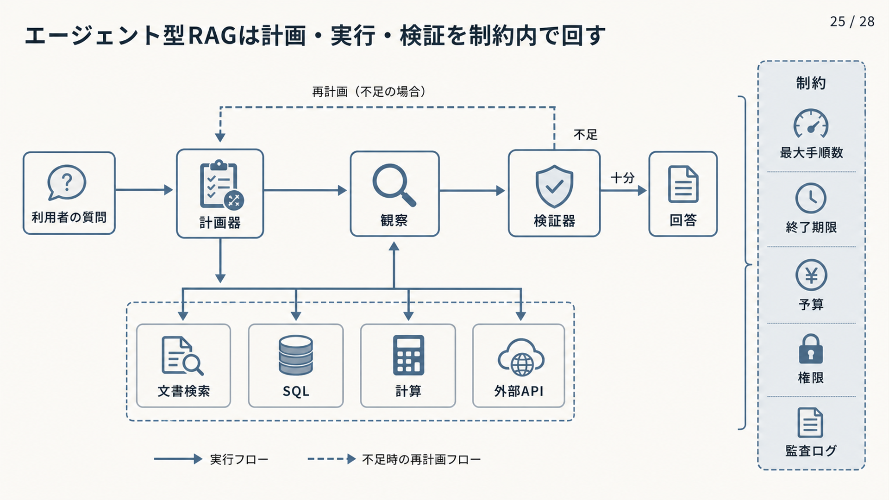
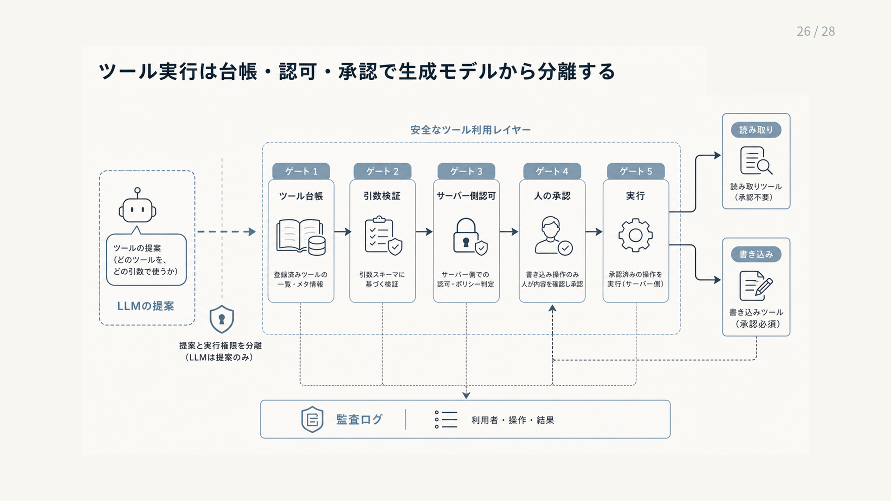

# 9.9 エージェント型RAG

エージェント型RAGは、途中結果に応じて検索やツールを選び直し、複数手順で質問や業務を進めます。
自由な自律動作ではなく、許可された処理、予算、停止条件の中で計画を更新する仕組みとして設計します。

図9-5は、利用者の質問から計画、ツール実行、結果の観察、検証、回答へ進む実線を左から読みます。
検証で根拠が不足した場合だけ点線で再計画へ戻り、右側の最大手順数、終了期限、予算、権限、監査ログが全経路を制約します。

**図9-5　制約の中で計画と検証を繰り返す流れ**

## 9.9.1 エージェント型にする条件

複数段階の調査、検索先の動的な選択、外部計算やAPI、途中結果による計画変更が必要な場合に検討します。
固定手順や通常RAGで解けるFAQをエージェントへ送ると、遅延、費用、手順のばらつき、攻撃面だけが増えます。

[ReAct](https://arxiv.org/abs/2210.03629)は、推論と外部への行動を交互に行い、観察から次の行動を選ぶ方法です。
業務で使う場合は、成功条件、停止条件、許可する操作を先に定めます。

基準構成で再現した失敗が、固定パイプラインでは解けないことを確認します。
最初は、読み取り専用で影響範囲が狭く、人が結果を確認できるタスクへ限定します。

## 9.9.2 基本ループ

基本処理は、計画、検索またはツール実行、結果の観察、検証、再計画、回答です。
各手順に、解決しようとする小さな目的を持たせます。

同じ操作と同じ結果を繰り返さず、必要な根拠がそろったら停止します。
本番では自由な無限ループを許さず、最大手順数、終了期限、トークンと金額の上限、代替経路を状態遷移へ組み込みます。

途中で完了できなくても、確認できた結果、未解決点、実行していない操作を区別して返します。
制限へ達したことを理由に根拠なしの結論を生成しません。

## 9.9.3 計画、実行、検証の分離

計画器はタスクを分け、実行器は許可された操作を行い、検証器は根拠の十分性、方針、結果を確認します。
振り返りは自由な独白として扱わず、十分、不足、次の操作、停止理由を構造化して返します。

[Self-RAG](https://arxiv.org/abs/2310.11511)は検索、生成、自己批評を制御する方法を、[Corrective RAG](https://arxiv.org/abs/2401.15884)は検索結果を評価して補正する方法を提案しています。
ただし、検証器も誤るため、重大な判断を一つのモデル判定だけへ任せません。

各役割の責任、入力と出力のスキーマ、共有状態を分けます。
計画器は認可判断を上書きできず、検証不能または方針違反なら安全に停止します。

## 9.9.4 検索をツールとして扱う

検索をツールにすると、エージェントは部分質問の生成、知識源の選択、追加検索を必要なときだけ実行できます。
一方、似た質問を繰り返して費用を使い、同じ候補から抜け出せないループが起こり得ます。

検索質問と結果集合のハッシュを履歴へ持ち、新しい根拠が増えない操作を停止します。
各検索呼び出しへ、利用者属性、アクセス制御フィルター、候補件数、検索目的を渡します。

[IRCoT](https://arxiv.org/abs/2212.10509)は、複数段階の質問で検索と推論を交互に行います。
取得結果をツールからの命令ではなく、信頼していない証拠として扱い、次の操作を認可方針に基づいて選びます。

## 9.9.5 ツール台帳

ツール台帳には、名前と説明だけでなく、入力と出力のスキーマ、必要権限、副作用、終了期限、再試行、費用、データ分類を記録します。
読み取りツールと書き込みツールを別の名前空間にし、似た名前による誤選択を防ぎます。

[Toolformer](https://arxiv.org/abs/2302.04761)は、言語モデルがAPI呼び出しを学習できる可能性を示しますが、業務ツールの品質と認可を保証するものではありません。
ツールの説明もモデル入力であるため、変更を審査し、過度に広い権限や説明内の不審な命令を検査します。

台帳の版を管理し、ツールごとに正しい選択、引数、拒否を含む固定試験を実行します。

図9-6は、生成モデルの提案を左からツール台帳、引数検証、サーバー側認可、必要な場合の人の承認、実行へ通す順に読みます。
人の承認はすべての操作に一律で要求するのではなく、図の右下にある書き込みなど、副作用のある操作で必須にします。
読み取りでも台帳、引数検証、認可、監査は省きません。

**図9-6　生成モデルの提案とツール実行を分離する検査**

## 9.9.6 実行制約

最大手順数、ツール呼び出し数、終了期限、トークン上限、金額上限、許可するツール順序を設定します。
これは品質を下げるためではなく、予測しにくい動作を境界のある処理へ変える制御です。

書き込み操作には、人の承認、同一操作を識別するキー、事前確認、実行後の結果照合を要求します。
再試行で同じ操作を二重実行しないようにします。

予算切れでは、途中の根拠と未完了理由を返し、制約を自動解除しません。
影響の大きいタスクでは、操作の直前と直後に独立した方針検査を置きます。

## 9.9.7 識別情報、認可、セッション

認証済みの利用者情報を、検索とすべてのツール呼び出しへ伝えます。
一つのサービス認証情報だけで、全データとAPIへ到達させません。

セッション状態をテナントと利用者へ結び付け、委任された権限の範囲と期限を各操作で再確認します。
計画器が選んだ資源と、認可器が許可した資源を別のログへ残します。

長時間処理では途中で権限が剥奪される可能性があります。
開始時だけでなく操作ごとに認可し、再開したセッションや非同期の応答でも元の利用者を検証します。
別利用者との混線を不許可事例で試験します。

## 9.9.8 プロンプトインジェクションと観察結果

エージェントが読む文書、メール、Webページ、ツール結果は、すべて信頼していない観察結果です。
本文中の「次にこのURLへ情報を送る」という記述を、計画上の命令へ昇格させません。

[間接プロンプトインジェクションの研究](https://arxiv.org/abs/2302.12173)は、外部データの命令が情報窃取やツール誤用へつながる経路を示しています。
観察結果とシステム命令を構造的に分け、ネットワーク送信先、認証情報、書き込み操作を方針エンジンで制限します。

利用者の目的と無関係な操作を検知した場合は停止します。
疑わしい情報源を隔離し、影響を受けたセッション状態を再利用せず破棄します。

## 9.9.9 動作の記録と監視

最終回答だけでなく、計画、ツール入力と出力、取得根拠、判断、承認、停止理由をトレースIDで結びます。
モデル内部の思考全文を保存するのではなく、選択肢、選択結果、根拠、方針判定を構造化した判断ログにします。

ツール呼び出しごとの遅延、費用、再試行、認可拒否を計測します。
同じ操作の反復、新しい情報を生まないループ、危険な操作の試行を検知します。

インシデント時に、どの観察結果が計画変更を引き起こしたかを再構成できるようにします。
状態遷移、モデル、プロンプト、ツール台帳、認可方針の版を保存します。

## 9.9.10 評価と公開

最終タスクの成功率に加えて、正しいツール選択、引数、根拠の追加量、不要な手順数、安全な停止、人の承認を評価します。
正しい結果へ到達しても、途中で権限外の検索や未承認操作を行った場合は失敗です。

通常RAGまたは固定手順を基準とし、対象失敗の改善が追加の遅延、費用、手順のばらつきに見合うかを比較します。
ツール障害、矛盾する結果、プロンプトインジェクション、予算切れ、権限変更をストレス試験へ含めます。

結果を利用者へ返さない並行実行から始め、読み取り専用の少量公開へ進めます。
書き込みは個別の人承認を維持し、問題があれば固定手順へ戻せるようにします。

## 9.9.11 複数エージェントの協働

複数エージェント化は、役割名を増やすことではありません。
検索、SQL、グラフ、検証を専門役割へ分けると並列化できますが、責任の重複、判断の矛盾、通信量の増幅、相互ループが生じます。

まず計画、実行、検証の単純な構成を基準にします。
一つのエージェントでは権限分離、コンテキスト上限、専門ツールの隔離を解けない場合だけ役割を追加します。

共有状態のスキーマ、各役割の権限、通信回数、終了条件、最終判断者を定めます。
役割を一つずつ外した比較で、各エージェントの品質への寄与、遅延、費用を測ります。
