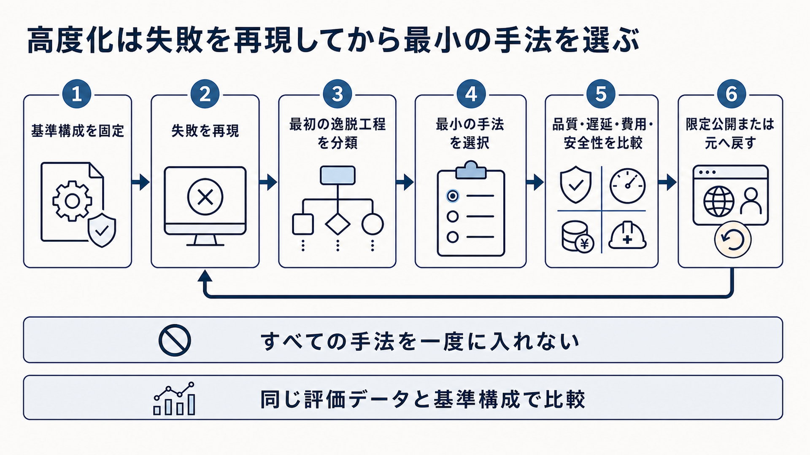

# 9. 失敗パターンに応じて高度化する

基本的なRAGを整えても、会話の省略、表の集計、長い資料の全体像、画像、複数システムの操作など、単純な文書検索では解けない問題が残ります。
このような問題には、失敗の原因に対応する追加手法を選びます。

本章では、検索を前提とした学習、会話、複数知識源、構造化データ、長文、階層、グラフ、エージェント、画像を扱う発展的な構成を説明します。
すべてを導入するのではなく、期待する改善と、増える費用、遅延、安全上の責任を比較して必要な手法だけを採用します。

図9-1は、高度化の手法を選び、導入可否を判断するまでの全体像です。
まず現在の基準構成を固定し、同じ条件で失敗を再現します。
次に、根拠が最初に失われた工程を特定し、その原因に対応する最小の手法だけを選びます。
品質、遅延、費用、安全性を基準構成と比較し、条件を満たせば限定公開、満たさなければ元へ戻します。

**図9-1　再現した失敗から最小の高度化手法を選ぶ流れ**
