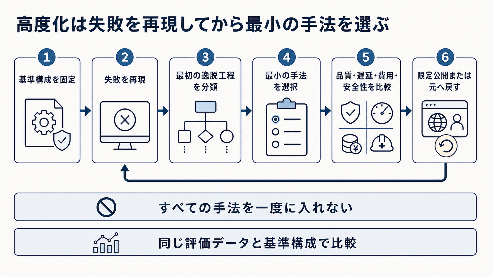

# 9. 失敗パターンに応じて高度化する

基本RAGの評価後も、会話文脈、複数source、構造化データ、長文、関係探索、図表、業務操作の各sliceで失敗が残るかを個別に確認します。

本章では、技術名から導入を決めず、観測した失敗パターンから必要な高度化を選びます。各方式について、効く問題、前提、評価指標、安全性、cost、導入判断を同じ順序で確認します。

本章では、代表研究が一定数引用され、複数の査読付き研究で効果が確認できる方式だけを扱います。
引用件数は時点、索引、著者統合、版の扱いによって変わるため、本文には固定値として掲載しません。件数を再調査するときは、取得元、検索式、論文のcanonical ID、取得時刻、保存した生応答への相対パスとSHA-256を `evidence/chapter-9-citation-counts/` に残します。掲載判断では、引用件数だけでなく、独立研究、対象タスク、比較条件、査読状況を確認します。

各方式の根拠と掲載範囲を次に示します。

- 本章では、[ConvGQR](https://aclanthology.org/2023.acl-long.274/)と[IterCQR](https://aclanthology.org/2024.naacl-long.449/)を会話中の省略を解決する検索書き換えの候補として扱い、同じ会話データと検索指標で比較します。
- **Federated・Routed RAG**は、[Adaptive-RAG](https://aclanthology.org/2024.naacl-long.389/)と[When and How to Augment Your Input](https://aclanthology.org/2025.findings-naacl.200/)を根拠に、情報源別のRecallと費用を測るルーティングを扱います。
- 本章では、[Spider](https://aclanthology.org/D18-1425/)をtext-to-SQLの評価データ、[RAT-SQL](https://aclanthology.org/2020.acl-main.677/)をschema linkingを用いるSQL生成方式として参照し、読み取り専用、許可schema、実行検証は本ガイドの安全要件として別に定めます。
- **Long-context RAG**は、[Lost in the Middle](https://aclanthology.org/2024.tacl-1.9/)を根拠に、長文入力では重要情報の位置による性能差を評価し、検索との比較には別の直接根拠を割り当てます。
- 本章では、[RAPTOR](https://proceedings.iclr.cc/paper_files/paper/2024/hash/8a2acd174940dbca361a6398a4f9df91-Abstract-Conference.html)と[Dynamic Tree Memory](https://proceedings.iclr.cc/paper_files/paper/2025/file/0382cb76309820f71c6eacd47b36ce71-Paper-Conference.pdf)を階層型検索の候補として扱い、概要質問の品質、要約誤り、検索費用を同じ評価データで比較します。
- 本章では、[G-Retriever](https://proceedings.neurips.cc/paper_files/paper/2024/file/efaf1c9726648c8ba363a5c927440529-Paper-Conference.pdf)、[HippoRAG](https://proceedings.neurips.cc/paper_files/paper/2024/hash/6ddc001d07ca4f319af96a3024f6dbd1-Abstract-Conference.html)、[KnowGPT](https://proceedings.neurips.cc/paper_files/paper/2024/hash/0b8705a611ed1ce19cdb759031078705-Abstract-Conference.html)を関係検索の異なる候補として扱い、対象graph、検索方式、評価条件を分けて比較します。各研究のグラフ構築法と評価条件を区別して比較します。
- 本章では、[ColPali](https://proceedings.iclr.cc/paper_files/paper/2025/file/99e9e141aafc314f76b0ca3dd66898b3-Paper-Conference.pdf)と[Document Screenshot Embedding](https://aclanthology.org/2024.emnlp-main.373/)を文書画像検索の候補として扱い、レイアウトと表を含む同じ評価データでRecall、遅延、保存量を比較します。
- **Agentic RAG**は、[IRCoT](https://aclanthology.org/2023.acl-long.557/)を根拠に、一つのエージェントが推論途中で検索を反復する方式を扱います。
- 本章では、[REALM](https://proceedings.mlr.press/v119/guu20a.html)の事前学習時検索と[RETRO](https://proceedings.mlr.press/v162/borgeaud22a.html)のchunk-level検索を検索結合位置の異なる候補として扱い、corpus更新、学習費用、推論費用を各研究の条件を分けて比較します。RAFTとRA-DITは、それぞれの評価条件に限定して扱います。

製品固有のルーターや生成SQLを無条件に有効とみなさず、情報源別の検索Recall、実行制約、認可を評価します。

各方式は、対象となる失敗、仕組み、研究上の根拠、評価方法、停止条件の順に確認します。単一の指標や一つのデータセットだけで一般化せず、基本構成との差を同じ評価データで測ります。

**図9-1　再現した失敗から最小の高度化手法を選ぶ流れ**
