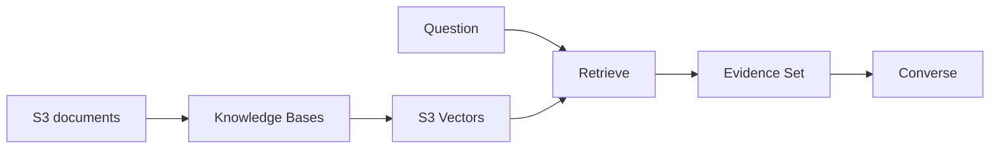

import { Aside, Steps } from '@astrojs/starlight/components';
import Checkpoint from '../../components/Checkpoint.astro';

## ゴール

このハンズオンでは、S3へ置いた3つのサンプル文書をKnowledge Basesでchunk化・embeddingし、S3 Vectorsへ登録します。質問時は`Retrieve`で候補を取得し、取得本文だけをEvidence Setとして`Converse`へ渡します。

<Aside type="note" title="この構成で学べる境界">
  Knowledge Basesは取り込みと検索を担当し、生成はConverseへ分離します。検索結果の`text`、`score`、`source URI`を先に観察できるため、「検索できた」と「正しく回答できた」を混同しません。
</Aside>

## 進め方

<Steps>

1. **準備**：CloudShellの認証、リージョン、CLI、モデルを検証します。
2. **Offline Layer**：文書、vector store、IAM role、Knowledge Base、data sourceを作成して同期します。
3. **Online Layer**：`Retrieve`で検索し、metadata filterと候補数を比較します。
4. **Generation**：取得した根拠だけを`Converse`へ渡し、citation ID付きの回答を生成します。
5. **Cleanup**：作成したリソースを依存順に削除し、残存がないことを確認します。

</Steps>

## 必要な権限

実習者のIAM principalには、少なくとも次の操作を許可する必要があります。組織のSCP、permissions boundary、session policyで拒否されている場合は、管理者へハンズオン用sandbox accountまたはroleを依頼してください。

| 対象 | 主な権限 |
|---|---|
| STS | `sts:GetCallerIdentity` |
| S3 | bucketとobjectの作成・取得・削除 |
| S3 Vectors | vector bucket、policy、indexの作成・参照・削除 |
| Bedrock | model一覧・呼び出し、Knowledge Base・data source・ingestionの管理、`Retrieve` |
| IAM | roleとinline policyの作成・参照・削除、`iam:PassRole` |

<Aside type="caution" title="本番アカウントでは実施しないでください">
  ハンズオンは検証用アカウントで実施してください。作成するKnowledge Base用roleは対象S3 bucket、embedding model、vector indexだけへ権限を限定しますが、実習者自身にはリソース作成権限が必要です。
</Aside>

<Checkpoint>

- 検証用AWSアカウントを使える
- 東京リージョンでCloudShellを起動できる
- IAM roleを作成し、Bedrockへpassできる
- 終了後にCleanupまで実行できる時間がある

</Checkpoint>

[CloudShellを準備する →](/rag-guide/01-prepare-cloudshell/)
